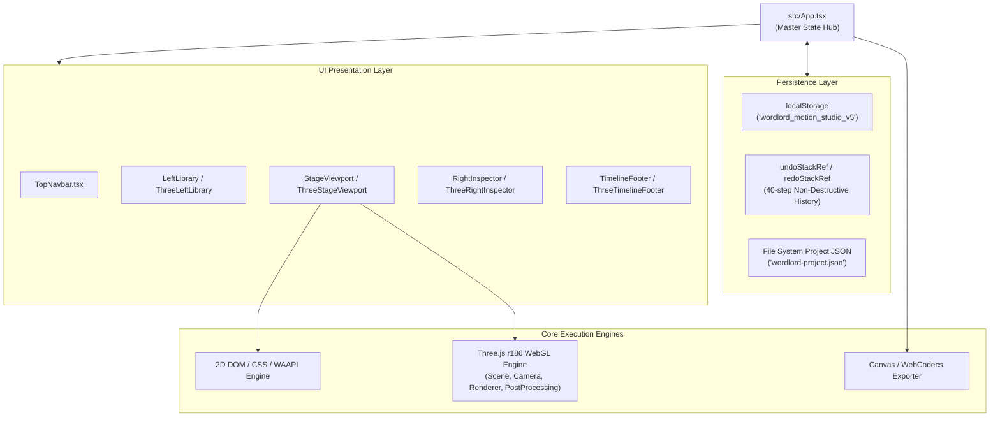

# Architecture & Technical Reference: WordLord SVG Motion Studio

WordLord SVG Motion Studio is engineered as an enterprise-grade standalone single-file motion graphics application. It operates with zero external server dependencies, packing all components, shaders, fonts, and icons into an inlined executable.

---

## 1. Directory & Codebase Topology

```
wordlord-svg-motion-studio/
├── index.html                   # Vite entry point
├── package.json                 # React 19, Three.js r186, Tailwind CSS 3.4, Vite 6
├── vite.config.ts               # Bundling config with vite-plugin-singlefile
├── scripts/
│   └── copy-build.js            # Syncs dist/index.html to root, disk 2, and Desktop
├── src/
│   ├── main.tsx                 # React DOM mount root
│   ├── App.tsx                  # Master application shell & state orchestration
│   ├── index.css                # Obsidian theme variables, typography & layout resets
│   ├── components/
│   │   ├── TopNavbar.tsx        # Global chrome, undo/redo, file save/load, shortcuts
│   │   ├── StageViewport.tsx    # 2D SVG vector canvas with V/H navigation deck
│   │   ├── ThreeStageViewport.tsx # 3D WebGL viewport with OrbitControls & raycasting
│   │   ├── LeftLibrary.tsx      # 2D Motion presets & shader styles library
│   │   ├── ThreeLeftLibrary.tsx # 3D Material presets, environment HDRI, light setups
│   │   ├── RightInspector.tsx   # 2D Parameter inspector & easing editor
│   │   ├── ThreeRightInspector.tsx # 3D PBR material, lighting & transform inspector
│   │   ├── TimelineFooter.tsx   # 2D Multi-track timeline & transport bar
│   │   ├── ThreeTimelineFooter.tsx # 3D Camera sequencer & effect stack timeline
│   │   ├── VideoExportModal.tsx # 2D Video export dialog (MP4/WebM/GIF)
│   │   ├── ThreeExportModal.tsx # 3D Video & GLTF/GLB export dialog
│   │   ├── ShortcutsModal.tsx   # Keyboard shortcuts cheat-sheet modal
│   │   ├── PanelResizer.tsx     # Draggable divider between sidebar and stage
│   │   ├── Tooltip.tsx          # Micro-interaction contextual tooltips
│   │   └── inspector/           # Reusable design system form primitives:
│   │       ├── InspectorSection.tsx  # Collapsible panel section with icon & toggle
│   │       ├── SliderField.tsx       # Standardized scrubbable range slider
│   │       ├── SegmentedField.tsx    # Tabbed pill switcher
│   │       ├── ColorSwatchField.tsx  # Color picker with active hex preview
│   │       └── SettingRow.tsx        # Standardized label-control horizontal flex row
│   ├── utils/
│   │   ├── threeEngine.ts       # 3D Scene setup, SVG extrusion, PBR materials, procedural textures
│   │   ├── videoExporter.ts     # Double-buffered canvas recording engine for 2D
│   │   ├── projectState.ts      # State serialization, JSON export/import, localStorage sync
│   │   ├── audio.ts             # Synthesized sound effects (clicks, render complete)
│   │   └── easing.ts            # Cubic-bezier mathematics & evaluation
│   ├── data/
│   │   ├── motions.ts           # 12 Kinetic motion preset definitions
│   │   ├── styles.ts            # 8 Visual optical style definitions
│   │   └── threePresets.ts      # 3D Material & lighting preset configurations
│   └── types/
│       ├── index.ts             # 2D Types (MotionPreset, StylePreset, LayerVisibility, etc.)
│       └── threeStudio.ts       # 3D Types (ThreeConfig, PartTransform, LightConfig, etc.)
```

---

## 2. State Architecture & Data Flow



### Persistence & Non-Destructive History
- State changes update `projectConfig` and are debounced (500ms) before committing to `localStorage`.
- All destructive actions (preset changes, resets, imports) push state snapshots to `undoStackRef`.
- `Cmd+Z` pops from `undoStackRef` and pushes to `redoStackRef`.
- `Cmd+Shift+Z` or `Cmd+Y` pops from `redoStackRef` and restores forward.
- Project JSON export captures the complete application schema: 2D config, 3D config, custom SVG paths, and color palettes.

---

## 3. 3D WebGL Pipeline (`src/utils/threeEngine.ts`)

### SVG Vector Extrusion Workflow
1. **Path Parsing**: Uses `SVGLoader` or direct SVG path d-strings.
2. **Decomposition**: Shapes are classified into parts (`monolithicD`, `stemW`, `crestW`, `spineR`, `ringO`, `mediaSubbrand`).
3. **Shape Construction**: Convert SVG path coordinates to `THREE.Shape` and `THREE.Path` holes.
4. **Extrusion**: `THREE.ExtrudeGeometry` generates front/back faces and side chamfers with specified bevel settings.
5. **Centering & Normalization**: Geometry bounding boxes are computed and centered around `(0, 0, 0)` origin.
6. **Material Binding**: `THREE.MeshPhysicalMaterial` is bound with PBR properties, procedural textures, and custom vertex/fragment uniforms if required.
7. **Scene Graph**: Parts are attached to a master `THREE.Group` governed by collective Euler transforms.

### Procedural Texture Canvas Engine
Generates seamless 512×512 off-screen canvas patterns:
- `createFlutedTexture()`: Sinusoidal horizontal luminescence for ribbed glass/metal.
- `createBrushedTexture()`: Directional horizontal grain noise with variable density.
- `createCarbonTexture()`: 2D checkerboard diagonal weave.
- `createKnurlTexture()`: Diamond cross-hatch micro-geometry.
- Returns a `THREE.CanvasTexture` with `wrapS = THREE.RepeatWrapping`, `wrapT = THREE.RepeatWrapping`, and anisotropy filtering.

---

## 4. Render & Video Export Pipeline (`src/utils/videoExporter.ts`)

1. **Off-screen Canvas Buffer**: An offscreen canvas is allocated with target resolution (e.g. 1920×1080 or 3840×2160).
2. **Frame-by-Frame Deterministic Rendering**:
   - The animation clock is advanced programmatically at exact intervals:
     $$\Delta t = \frac{1}{\text{targetFPS}}$$
   - Eliminates frame drops, stutter, or variable frame rate issues inherent in realtime screen capture.
3. **Capture & Encoding**:
   - For 2D: Serializes the SVG DOM with updated inline transform attributes and draws onto the canvas via `Image()` bitmap rendering.
   - For 3D: Forces `renderer.render(scene, camera)` at timestamp $t$ and reads the WebGL canvas pixels.
4. **Stream Muxing**: Frames are piped to `MediaRecorder` or `WebCodecs` using `VP9` / `H.264` codec profiles.
5. **File Generation**: Produces a `Blob` URL and automatically triggers a browser download.
