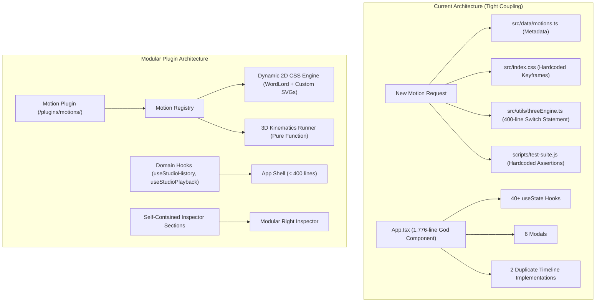

# Modular Architecture & Extensibility Plan — WordLord SVG Motion Studio

> **Version**: 5.1.0  
> **Status**: Approved Roadmap & Action Plan  
> **Target**: Decoupled Plugin Engine, Universal SVG Customizability, Domain Hooks, Camera Motion Kinematics  

---

## 1. Latent Architectural Bottlenecks Discovered



### Key Issues Identified Underneath the Code:
1. **The 4-File Motion Registration Triad**: Adding any motion requires modifying `motions.ts`, `index.css`, `threeEngine.ts` (400-line switch statement), and `test-suite.js`.
2. **Custom SVG Multi-Part Animation Fallback in 2D**: When custom SVGs are uploaded, keyframes targeting `#group-word` or `#group-lord` leave parts static.
3. **Ephemeral Custom Asset Storage**: Uploaded SVGs exist only in transient React memory; no indexed user asset bank in `localStorage`.
4. **App.tsx God-Component (1,776 lines)**: 40+ useState hooks, 6 modals, and 3 workspaces tangled in one component.
5. **Timeline Duplication (1,300 lines)**: 2D and 3D timelines duplicate UI chrome but have decoupled data models.
6. **Monolithic 1,400-Line Inspectors**: Hardcoded accordion sections rather than composable modules.
7. **Lack of Dynamic Camera Motion Kinematics**: 3D animations moved only meshes; camera was mostly stationary during kinetic playback.

---

## 2. Target Modular Architecture

```
src/
├── plugins/
│   ├── motions/                     # Self-contained Motion Plugins
│   │   ├── index.ts                 # Central Motion Registry
│   │   ├── types.ts                 # MotionPlugin interface
│   │   ├── cameraOrbit.plugin.ts    # Camera trajectory plugins
│   │   ├── cameraDolly.plugin.ts
│   │   ├── cameraCrane.plugin.ts
│   │   ├── cameraCorkscrew.plugin.ts
│   │   └── ... (one file per motion)
│   ├── materials/                   # PBR Material Plugins
│   │   ├── index.ts                 # Material Registry
│   │   └── obsidian.plugin.ts
│   └── assets/                      # User & Default Asset Registry
│       ├── index.ts                 # Persistent User Asset Bank (localStorage)
│       └── userAssetStore.ts
├── hooks/                           # Domain Hooks extracted from App.tsx
│   ├── useStudioState.ts            # Core params (optics, palette, geometry)
│   ├── useStudioHistory.ts          # Undo/redo, continuous tweak debouncing
│   ├── useStudioPlayback.ts         # Unified 60 FPS playhead & RAF loop
│   └── useUserAssetBank.ts          # Multi-asset catalog & persistence
└── components/
    ├── inspector/sections/          # Isolated Inspector Accordion Sections
    │   ├── OpticsSection.tsx
    │   ├── PaletteSection.tsx
    │   ├── GeometrySection.tsx
    │   ├── PbrMaterialSection.tsx
    │   ├── LightingRigSection.tsx
    │   ├── CameraSection.tsx
    │   └── ObjectTransformSection.tsx
    └── timeline/
        └── UnifiedTimeline.tsx      # Shared transport deck & dynamic part tracks
```

---

## 3. Immediate Implementation: Camera Motion Animations

### New Camera-Driven Motion Engines:
1. **`camera-orbit` (Cinematic Orbital Drone)**: Autonomous $360^\circ$ dynamic circular orbit around the brand mark with vertical sinusoidal elevation.
2. **`camera-dolly` (Vertigo Dolly Zoom)**: Rapid plunge from depth ($z=750 \rightarrow 360$) with synchronized field-of-view compression ($55^\circ \rightarrow 40^\circ$).
3. **`camera-crane` (Hero Low-Angle Crane)**: Dramatic swoop from below ground level $(0, -120, 360)$ craning upward to eye-level hero lockup $(0, 40, 420)$.
4. **`camera-corkscrew` (Spiral Corkscrew Flyby)**: Helical flyby tracking around the logo monolith with banking roll angle.

### Integration Points:
- Viewport render loop evaluates camera trajectories on every frame and during video recording.
- Camera trajectory selector added to Section 5 ("Camera Optics & Geometry") in `ThreeRightInspector.tsx`.
- 2D CSS counterpart keyframes added for seamless cross-mode parity.
- Symmetrical undo support via `recordContinuousTweak`.
